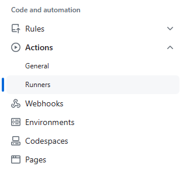
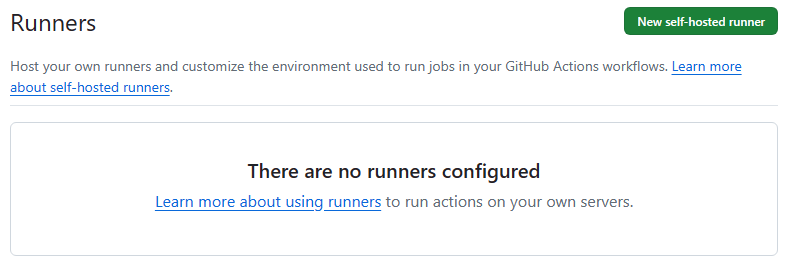
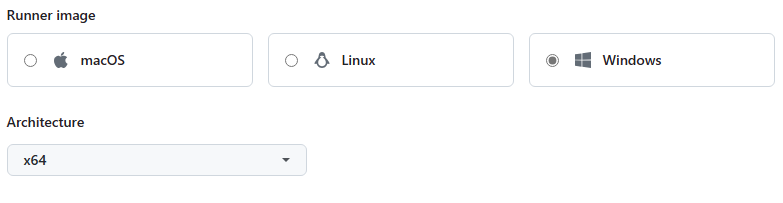

<h1>NI LabVIEW CLI - Predefined Command Line Operations (&#x1F6E0 Under Construction)</h1>

<h2>Introduction</h2>

You only need a GitHub repository to create and run a GitHub Actions workflow. In this guide, you'll add a workflow that demonstrates some of the essential features of GitHub Actions.

The following example shows you how GitHub Actions jobs can be automatically triggered, where they run, and how they can interact with the code in your repository.

<h2>GitHub Actions Runner on Windows</h2>

<h3>Adding a self-hosted runner to a repository</h3>

<h4>Download the GitHub Actions Runner for Windows</h4>
  

  <!--1.-->
&#x2776 On GitHub.com, navigate to the main page of the repository.

  <!--2.-->
&#x2777 Under your repository name, click <strong>Settings</strong>. If you cannot see the "Settings" tab, select the <strong>&#x22EF</strong> dropdown manu, then click <strong>Settings</strong>.

    

      
    

  <!--3.-->
&#x2778 In the left sidebar, clic <strong>Actions</strong>, then click <strong>Runners</strong>.

    

      
    

  <!--4.-->
&#x2779 Click <strong>New self-hosted runner</strong>.

    

      
    

  <!--5.-->
&#x277A Select the operating system image and architecture of your self-hosted runner machine.

    

      
    

    

    <blockquote>
      
[!IMPORTANT] Select Windows x64.

    </blockquote>
    

  <!--6.-->
&#x277B Download the latest runner package by paste the following url directly into the browser.

    

      
    

    

      Download the latest runner package
      https://github.com/actions/runner/releases/latest
    

For more information about how to Adding self-hosted runners, see this <a href="https://docs.github.com/en/actions/hosting-your-own-runners/managing-self-hosted-runners/adding-self-hosted-runners" title="Adding self-hosted runners">help topic</a>.

<h4>Configure and Run the GitHub Actions Runner on Windows</h4>
  

  <!--1.-->
&#x2776 Create a folder of the Windows under the drive root (e.g. "C:\actions-runner")

  <!--2.-->
&#x2777 Extract the installer in the folder created in the previous step.

  <!--3.-->
&#x2778 P.

    

    
The following snipped needs to be run on <code>powershell</code>:

    

    <pre><code class="language-powershell">Set-ExecutionPolicy -ExecutionPolicy RemoteSigned -Scope CurrentUser</code></pre>
    
It is necessary to execute the following command from PowerShell Admin, to communicate with a remote server

  <!--4.-->
&#x2779 Configure Runner.

    

    
The following snipped needs to be run on <code>cmd</code>:

    <pre><code class="language-cmd">config.cmd --url https://gitbub.com/...</code></pre>
    

    <blockquote>
    
[!IMPORTANT] it is necessary to ignore: $ ./

    </blockquote>
    <pre><code class="language-cmd"># Runner RegistrationEnter the name of the runner group to add this runner to: [press Enter for Default]: Enter # Runner will have the following labels: 'self-hosted', 'Windows', 'X64' Enter any additional labels (ex. label-1, label-2): [press Enter to skip]: Enter # Runner settings Enter name of work folder:[press Enter for _work]: Enter # Runner as service Would you like to run the runner as service? (Y/N) [press Enter for N]: Enter</code></pre>
    

  <!--5.-->
&#x277A Run Runner.

    

    
The following snipped needs to be run on <code>cmd</code>:

    <pre><code class="language-cmd">run.cmd</code></pre>
    

    <blockquote>
    
[!IMPORTANT] it is necessary to ignore: $ ./

    </blockquote>
    

  <!--6.-->
&#x277B Checking that your self-hosted runner was successfylly added.

    

    <pre><code class="language-cmd">&#x221A Connected to GitHub  YYYY-MM-DD HH:MM:SSZ: Listening for Jobs</code></pre>
    

For more information about how to use GitHub Actions Runner, see this <a href="https://github.com/actions/runner" title="GitHub Actions Runner">help topic</a>.

<h4>On GitHub.com, checking the status of a self-hosted runner</h4>
  

  <!--1.-->
&#x2776 In your repository, navigate to the main page and click <strong>Settings</strong>.

  <!--2.-->
&#x2777 In the left sidebar, click <strong>Actions</strong>, then click <strong>Runners</strong>.

  <!--3.-->
&#x2778 Under "Runners", you can view a list of registered runners, including the runner's name, labels, and status.

  

  The status can be one of the following: 
  * <strong>Idle</strong>: The runner is connected to GitHub and is ready to execute jobs. 
  * <strong>Active</strong>: The runner is currently executing a job. 
  * <strong>Offline</strong>: The runner is not connected to GitHub. This could be because the machine is offline, the self-hosted runner application is not running on the machine, or the self-hosted runner application cannot communicate with GitHub. 
  

                       

For more information about how to Monitoring and troubleshooting self-hosted runners, see this <a href="https://docs.github.com/en/actions/hosting-your-own-runners/managing-self-hosted-runners/monitoring-and-troubleshooting-self-hosted-runners" title="Monitoring and troubleshooting self-hosted runners">help topic</a>.

<h5>Related concepts:</h5>

<a href="https://docs.github.com/en/actions/hosting-your-own-runners/managing-self-hosted-runners/configuring-the-self-hosted-runner-application-as-a-service">Configuring the self-hosted runner application as a service.</a>
<a href="https://docs.github.com/en/actions/hosting-your-own-runners/managing-self-hosted-runners/removing-self-hosted-runners">Removing self-hosted runners.</a>
